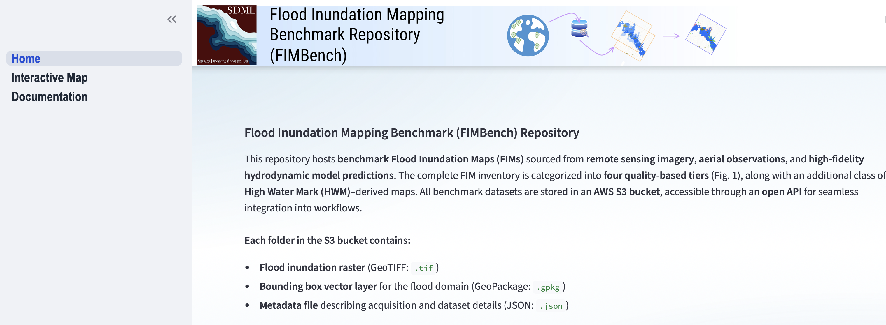
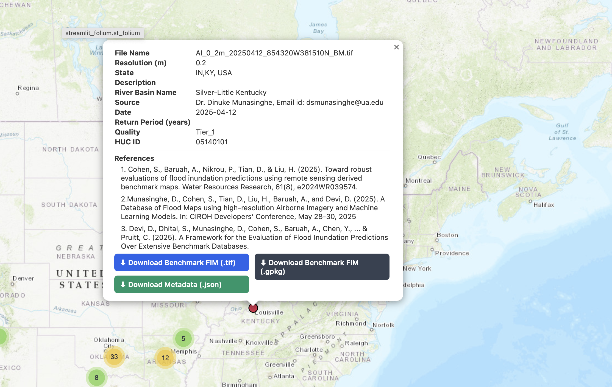

## **Flood Inundation Mapping Benchmark (FIMbench) Repository**

This repository provides a curated collection of benchmark **Flood Inundation Maps (FIMs)** derived from multiple high-quality sources, including remote sensing imagery, aerial observations, and high-fidelity hydrodynamic model outputs. The complete FIM inventory is organized into **four quality-based tiers** (Fig. 1), along with an additional category containing **High Water Mark (HWM)–derived flood maps**. All benchmark datasets are hosted in an **AWS S3 bucket** and can be accessed through an **open API**, enabling seamless integration into research pipelines, visualization tools, and operational workflows.

   
  <em>Fig. 1. Structure of FIMbench.</em>

---
### **Home Interface**
Here, the background about the benchmark data, how it is acquired and structured into the database is well explained. 

  
   
  <em>Fig. 2. FIMbench Visualizer Interface.</em>

### **FIM Visualizer Interface**

The FIM Visualizer offers an interactive platform for browsing and exploring benchmark FIM datasets across all quality tiers.👉 **Click here to open the FIMbench Visualizer**
A preview of the interface is shown below:

  
   
  <em>Fig. 2. FIMbench Visualizer Interface.</em>

### **Downloading Data from FIMbench Visualizer**

Each FIM location is displayed on the map, and zooming in reveals finer spatial detail. When a user clicks on a location, a pop-up window appears containing the full metadata for that benchmark. From this panel, users can directly download the flood inundation raster (.tif), metadata files, AOI layers, and other resources required for FIM evaluation. Downloads can be initiated either through the pop-up itself or seamlessly through the framework.
Below is an example of the information displayed when a user selects a FIM location, including flood details, FIM tier, spatial resolution, and additional metadata:

  
   
  <em>Fig. 3. Downloading FIM from the FIMbench Visualizer Interface.</em>

### **Benchmark Flood Raster Visualization**
The left panel allows users to filter FIM locations by tier, date, and other attributes, and also provides an option to display the FIM extent. Please note that the rendered FIM extent is a simplified representation for visualization purposes and may not reflect the precise flood boundary. For the full-resolution and accurate delineation, users should download the TIFF raster.
Below is an example of the interface when the FIM extent layer is activated:

  
   
  <em>Fig. 4. Visualizing Benchmark Flood Rasters.</em>

This interactive platform is live at: https://fimbench.streamlit.app/

### **For more information**

Email: sdhital@crimson.ua.edu
