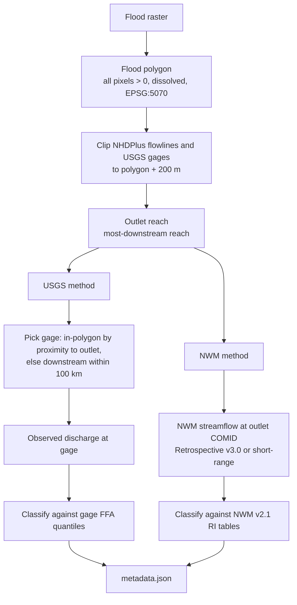
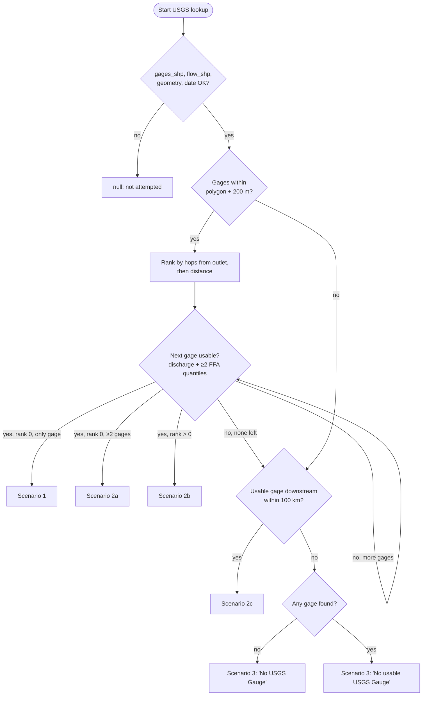

# Event Recurrence Interval

Every observed flood map in FIMbench is tagged with an **Event Recurrence
Interval (RI)**: how rare the flood was, given as a return period such as
`"25 yr"`. This page explains how that value is calculated for each FIM
category, which scenarios the calculation can end up in, and what each
possible output means.

The implementation lives in
[`processing_floodmap/recurrence_interval.py`](../src/fimbench/processing_floodmap/recurrence_interval.py).
It is a single-map port of the `fim_recurrence_pipeline_T1.ipynb` notebook
pipeline (FIMbench_RI), which processed many events in one batch.

---

## Contents

1. [Overview](#1-overview)
2. [FIM categories at a glance](#2-fim-categories-at-a-glance)
3. [Required reference data and configuration](#3-required-reference-data-and-configuration)
4. [Event date and time handling](#4-event-date-and-time-handling)
5. [Step 1: Build the flood polygon](#5-step-1-build-the-flood-polygon)
6. [Step 2: Find the outlet reach](#6-step-2-find-the-outlet-reach)
7. [USGS method](#7-usgs-method)
8. [USGS scenarios](#8-usgs-scenarios)
9. [NWM method](#9-nwm-method)
10. [Classifying a discharge into a recurrence interval](#10-classifying-a-discharge-into-a-recurrence-interval)
11. [Category-specific procedures](#11-category-specific-procedures)
12. [Output metadata fields](#12-output-metadata-fields)
13. [Failure cases and diagnostics](#13-failure-cases-and-diagnostics)
14. [Constants and tunable parameters](#14-constants-and-tunable-parameters)
15. [Worked examples](#15-worked-examples)

---

## 1. Overview

Each flood map gets **two independent RI estimates**, both computed from the
same flood polygon and the same event date:

| Estimate | Discharge source | Flood-frequency reference |
|---|---|---|
| **USGS** | Observed streamflow (NWIS parameter `00060`) at a USGS streamgage linked to the flood | That gage's published peak-flow flood-frequency quantiles (Bulletin 17C) from USGS StreamStats GageStatsServices |
| **NWM** | Modeled streamflow from the National Water Model at the flood's outlet reach (NHDPlus COMID) | NWM v2.1 recurrence-interval tables (`nwm21_17C_recurr_{yr}_0_cms.csv`) |

In both cases the procedure is the same: find the right location for the
flood, get the event discharge there, and compare that discharge with the
2, 5, 10, 25, 50 and 100-year flood discharges for that location.



A failed RI lookup **never stops processing**. If something is missing or
cannot be resolved, the reason is logged and the metadata field gets a
placeholder value (see [Section 12](#12-output-metadata-fields)). The rest
of the metadata is still written.

---

## 2. FIM categories at a glance

| Category | Processor | Event timing | Discharge used | RI computed? |
|---|---|---|---|---|
| **Tier 1**: Aerial Imagery | `Tier1Processor` | Date (`YYYYMMDD`), sometimes date and time | Daily maximum of hourly discharge for that date | Yes (USGS + NWM) |
| **Tier 2**: PlanetScope Scene | `Tier2Processor` | Date and UTC acquisition time (`YYYYMMDDTHHMMSS`) | Discharge at the observation/timestep nearest that instant | Yes (USGS + NWM) |
| **Tier 3**: Sentinel-1A | `Tier3Processor` | Date and UTC acquisition time (`YYYYMMDDTHHMMSS`) | Discharge at the observation/timestep nearest that instant | Yes (USGS + NWM) |
| **HWM**: High Water Marks | `HwmProcessor` | Flood window: start and end date | **Maximum** discharge anywhere in the window | Yes (USGS + NWM, range variant) |
| **FEMA BLE** (Tier 4, synthetic) | `FemaBleProcessor` | None. It is a design event | Not applicable | **No**. The return period is user-supplied |

Gage selection, outlet selection, scenario logic and classification are
**identical** for every observed category. Only two things change between
categories:

1. **How the event time is read** (a single day, an exact instant, or a
   window).
2. **How discharge is pulled from the time series** (daily max, nearest
   value, or max over the window).

---

## 3. Required reference data and configuration

The RI lookups need three local reference datasets. They are **not shipped
with the FIMbench package**:

| Parameter | Content | Required fields | Used by |
|---|---|---|---|
| `gages_shp` | USGS streamgage points | `SOURCE_FEA` (USGS site number), `FLComID` (COMID of the reach the gage sits on) | USGS |
| `flow_shp` | NHDPlus flowline network | `COMID`, `FromNode`, `ToNode`, `TotDASqKm` | USGS and NWM |
| `recurr_folder` | Folder of NWM v2.1 RI tables, one CSV per return period: `nwm21_17C_recurr_{2,5,10,25,50,100}_0_cms.csv` | `feature_id`, `discharge` (cms) | NWM |

Vector files without a CRS are assumed to be EPSG:4326. These are national
datasets, so only a bounding box around the flood is read from them (see
[Section 14](#14-constants-and-tunable-parameters)).

Pass the paths to any observed-flood processor:

```python
from fimbench.processing_floodmap import Tier2Processor

proc = Tier2Processor(
    gages_shp="ref/usgs_gages.shp",
    flow_shp="ref/nhdplus_flowlines.shp",
    recurr_folder="ref/nwm21_recurrence/",
    downstream_gage_max_km=100.0,   # optional, default 100 km
)
proc.process("input/", "output/", flood_date="20170504T235530")
```

If a path is not configured (default `None`), that lookup is skipped:

- Without `gages_shp` or `flow_shp`, the USGS RI is not computed (`null`).
- Without `flow_shp` or `recurr_folder`, the NWM RI is set to
  `"NWM not configured"`.

Network access is also required for:

- USGS NWIS instantaneous values and the series catalog (through `dataretrieval`)
- USGS StreamStats GageStatsServices (`https://streamstats.usgs.gov/gagestatsservices`)
- NWM data on AWS (anonymous S3): `noaa-nwm-retrospective-3-0-pds` and `noaa-nwm-pds`

---

## 4. Event date and time handling

### 4.1 Single-event categories (Tier 1, 2, 3)

`flood_date` is either passed explicitly or inferred from the file path.
The RI module then chooses a retrieval path **based on the format of the
string**, not on the tier:

| `flood_date` format | Interpreted as | Retrieval path |
|---|---|---|
| `YYYYMMDD` (for example `20170504`) | That calendar day | **Daily-max path**: maximum hourly discharge on that day |
| `YYYYMMDDTHHMMSS` (for example `20170504T235530`) | That exact instant, **in UTC** | **At-time path**: discharge nearest that instant |
| `YYYYMMDDT…` where the time part doesn't parse | Logged, then treated as the date only | Daily-max path |
| Anything whose first 8 characters aren't a valid date | Unparseable | No RI (USGS `null`; NWM `"Could not parse flood_date"`) |

In practice, Tier 1 aerial imagery is usually date-only, while Tier 2
(PlanetScope) and Tier 3 (Sentinel-1) carry a satellite acquisition time.
If a Tier 1 file name does include a full `THHMMSS`, it uses the at-time
path too.

> **Give times as six digits (`HHMMSS`) in UTC.** Shorter time strings can
> be parsed ambiguously. For example, `T1530` is read as `15:03:00`, not
> `15:30`.

### 4.2 Range category (HWM)

High Water Marks have no single acquisition instant. They record the peak
stage reached during a flood, so the processor takes a **flood window**:

- `start_date` and `end_date` are both `YYYYMMDD` (only the first 8
  characters are read).
- The window is **inclusive** of both calendar days.
- If `end_date` is earlier than `start_date`, the two are swapped
  automatically.

> **Use four-digit years.** A six-digit value such as `"160928"` is not
> rejected. It is misread as 8 February 1609. Always pass `"20160928"`.

---

## 5. Step 1: Build the flood polygon

For every category, the processor first converts the flood raster into a
single **unified flood polygon**:

1. Read the EPSG:5070 (CONUS Albers) version of the raster.
2. Take every pixel with value > 0 as flooded.
3. Vectorize the flooded pixels, dissolve them into one (multi)polygon, and
   simplify by `SIMPLIFY_TOL`.

If no pixel is flooded, the RI is not computed and both RI fields stay
`null`.

All RI geometry work is done in **EPSG:5070** (`proj=5070`), so distances
and tolerances are in metres.

---

## 6. Step 2: Find the outlet reach

Both methods need the **outlet reach**: the most-downstream NHDPlus flowline
covered by the flood.

1. **Clip the network to the flood.** Keep the flowlines (and, for USGS, the
   gages) within **200 m** (`GAP_TOL`) of the flood polygon. The tolerance
   bridges gaps between the pieces of a fragmented, multipart flood map, so a
   reach or gage in a small gap is still captured. It only affects the
   spatial join. The flood geometry itself is never buffered or modified.
2. **Find topological sinks.** A reach is an *outlet candidate* if its
   `ToNode` is not the `FromNode` of any other clipped reach. In other
   words, the flow leaves the flood extent through it.
3. **Pick the main outlet.**
   - No sink found (for example a closed loop): the first clipped reach is used.
   - One sink: that reach is the outlet.
   - Several sinks (several streams leave the flood extent separately): the
     sink with the **most reaches upstream of it** is used, counted by a
     breadth-first walk upstream through the clipped network. This picks the
     main stem rather than a small side channel.

The choice is based on **topology only**. Drainage area and stream order are
not used.

If no flowline lies within 200 m of the flood, there is no outlet.

---

## 7. USGS method

### 7.1 Gage selection

Gages are tried **in order**, and the **first usable gage wins**. A gage is
*usable* only if **both** of the following hold:

- it returns observed discharge for the event (Section 7.2), **and**
- it has published flood-frequency statistics for **at least two** of the
  target return periods (Section 7.3).

The candidate order is:

**A. In-polygon gages** (within 200 m of the flood), ranked by proximity to
the outlet:

1. *Connected* gages, meaning gages whose `FLComID` lies on the network
   upstream of the outlet, ordered by the **fewest reaches (hops) from the
   outlet**. Ties are broken by straight-line distance to the outlet reach.
2. *Disconnected* gages, meaning gages on reaches the upstream walk didn't
   reach, ordered by straight-line distance to the outlet reach.

The gage closest to the outlet goes first because it best represents the
flow through the whole flooded reach.

**B. Downstream gages.** These are tried only if *no* in-polygon gage is
usable. Starting at the outlet's `ToNode`, the method walks **downstream**
along the full (unclipped) flowline network:

- Distance is measured **along the river**: the reach lengths walked, plus
  the gage's position along its own reach.
- The walk stops at **100 km** (`downstream_max_km`, configurable).
- Candidates are tried closest first. A gage already tried in step A is
  not retried.

### 7.2 Observed discharge

Discharge is USGS NWIS instantaneous values, parameter `00060` (discharge,
cfs), converted to cms (× 0.0283168). Site numbers shorter than 8 digits are
zero-padded.

| Path | Request window | Value used |
|---|---|---|
| Daily-max (Tier 1 date only) | The event day (00:00 to next day 00:00) | Instantaneous values resampled to hourly maxima, then the maximum of the day |
| At-time (Tier 2/3 with time) | ±1 hour around the event instant (`USGS_AT_TIME_WINDOW_HOURS`) | The single observation **nearest** the instant. USGS IV data are usually at 5 or 15 minute steps, so an exact match isn't required |
| Range (HWM) | `start_date` 00:00 to the day after `end_date` 00:00 | Hourly maxima, then the maximum over the whole window |

### 7.3 Flood-frequency quantiles (StreamStats)

For each candidate gage, published statistics are requested from USGS
StreamStats GageStatsServices (`/stations/{site}`, falling back to
`/statistics?stationIDOrCode={site}`). Then:

1. Only the **Peak-Flow Statistics** group (`PFS`) is kept. Flow-duration
   statistics are excluded because they are not flood quantiles.
2. Each statistic's **annual exceedance probability (AEP)** is read from its
   name (for example, "1-percent AEP flood") or its code (for example
   `PK1AEP`, `PK0_2AEP`).
3. The AEP is converted to a return period: **RI = 100 / AEP%**. For
   example, 4 % gives 25 yr and 1 % gives 100 yr.
4. Only exact matches to **2, 5, 10, 25, 50, 100 yr** are kept. Values are
   converted to cms (assumed cfs unless the unit says otherwise).
5. At least **two** of these return periods are required. Otherwise the gage
   is rejected as having no usable flood-frequency statistics.

The discharge is then classified against these quantiles (Section 10).

---

## 8. USGS scenarios

The USGS lookup always ends in one of the scenarios below. The *scenario*
string is returned by `get_event_recurrence_interval_usgs(...)` (3rd return
value). Its wording follows the Scenario 1/2/3 terminology of the original
notebook pipeline. The processors use only the label, discharge and gage ID
from it. The scenario itself is not written to `metadata.json`, but the
decision path is logged.

### Scenario 1: one gage in the flood, and it is usable

**Situation:** exactly one USGS gage lies within the flood polygon (+200 m),
and it has both event discharge and flood-frequency statistics.

**Result:** that gage is used.

- RI label: classified (for example `"10 yr"`)
- Discharge: the gage's observed discharge
- Gage ID: that gage
- Scenario string: `Scenario 1: single in-polygon gage {gid}`

### Scenario 2: multiple gages, or a fallback gage

Scenario 2 covers every case where a gage other than "the only one in the
polygon" ends up being used. It has three sub-cases.

#### 2a. Several in-polygon gages: the closest to the outlet is used

**Situation:** two or more gages lie in the flood, and the top-ranked one
(fewest reaches from the outlet) is usable.

**Result:** the top-ranked gage is used.

Scenario string:
`Scenario 2: {n} in-polygon gages, fewest reaches from outlet -> gage {gid}`

#### 2b. Primary in-polygon gage unusable: next in-polygon gage is used

**Situation:** the top-ranked in-polygon gage cannot be used. For example, it
was not recording during the event, it has been discontinued, or it has no
published flood-frequency statistics. A lower-ranked in-polygon gage is
usable.

**Result:** the first usable gage in rank order is used.

Scenario string:
`Scenario 2: primary in-polygon gage unusable; used fallback gage {gid} (proximity rank {k})`

#### 2c. No usable in-polygon gage: a downstream gage is used

**Situation:** no gage lies in the flood, or every in-polygon gage was
unusable. A usable gage exists downstream of the outlet within 100 km of
river distance.

**Result:** the nearest usable downstream gage is used.

Scenario string:
`Scenario 2: no usable gage in polygon ({n} found); used downstream gage {gid} ({d} km downstream of outlet)`

> A downstream gage measures flow from a larger drainage area than the
> flooded reach. Its RI is a proxy for how severe the event was regionally,
> rather than a direct measurement at the flood. Check `USGS Gauge ID` and
> the log when interpreting it.

### Scenario 3: no usable USGS gage, so rely on NWM

**Situation:** no usable gage in the polygon **and** none within 100 km
downstream. Two labels distinguish *why*:

| Label | Meaning |
|---|---|
| `"No USGS Gauge"` | No gage was found at all, in the polygon or downstream |
| `"No usable USGS Gauge"` | Gages were found, but every one was rejected. The reason for each one is logged (see [Section 13](#13-failure-cases-and-diagnostics)) |

- Discharge and Gage ID: `null`
- Scenario string:
  `Scenario 3: no usable USGS gage in polygon ({n} found) or within 100 km downstream -- use NWM`

In this scenario, the **NWM RI is the only available estimate** for the map.

### Not attempted

The USGS lookup returns `null` for label, discharge, scenario and gage ID
when it **could not be attempted**:

- `gages_shp` or `flow_shp` not configured
- empty or missing flood geometry
- unparseable `flood_date` (or HWM `start_date`/`end_date`)
- an unexpected error during the lookup (logged)

### Decision tree



---

## 9. NWM method

The NWM estimate has a **single resolution path**. It always uses the
outlet reach. There are no gage-style fallbacks.

### 9.1 Location

The outlet reach from [Section 6](#6-step-2-find-the-outlet-reach). Its
NHDPlus `COMID` is the NWM `feature_id`. If no outlet can be found, the NWM
RI is `"No outlet reach found"`.

### 9.2 Modeled discharge and data-source selection

The NWM data source depends on the **event year** (`RETRO_MAX_YEAR = 2023`):

| Event year | Source | Location |
|---|---|---|
| ≤ 2023 | **NWM Retrospective v3.0**, hourly `CHRTOUT` streamflow | `s3://noaa-nwm-retrospective-3-0-pds/CONUS/zarr/chrtout.zarr` |
| > 2023 | **NWM operational short-range**, `f001` channel output | `s3://noaa-nwm-pds/nwm.{YYYYMMDD}/short_range/nwm.t{HH}z.short_range.channel_rt.f001.conus.nc` |

The short-range product uses the **f001** file of each hourly run. Its valid
time is the initialization time + 1 hour, so it is the closest thing to a
model "nowcast" in the operational archive.

How the value is taken from the series:

| Path | Retrospective v3.0 | Short-range |
|---|---|---|
| Daily-max (Tier 1 date only) | Max hourly streamflow from 00:00:00 to 23:59:59 of the event day | Max over the 24 `f001` files valid on that day |
| At-time (Tier 2/3) | Timestep **nearest** the event instant | Event rounded to the **nearest hour**, then the `f001` file valid at that hour (initialized one hour earlier) |
| Range (HWM) | Max hourly streamflow from `start_date` 00:00 to `end_date` 23:59:59 | Max over every `f001` file on every day of the window |

**HWM windows that span the 2023/2024 boundary** pick the source by the
**year of `end_date`**. A window ending in 2024 or later therefore uses the
short-range archive for the entire window.

> The operational short-range bucket keeps only a limited rolling archive.
> For older post-2023 events the files may be gone, and the RI reads
> `"NWM discharge unavailable: no short-range file ... (archive expired?)"`.

### 9.3 NWM recurrence-interval tables

The six CSVs in `recurr_folder` (`nwm21_17C_recurr_{2,5,10,25,50,100}_0_cms.csv`)
are read and filtered to the outlet COMID. Each one holds the discharge for
one return period, derived from the NWM v2.1 retrospective with a Bulletin
17C analysis. Missing CSV files are logged, and those return periods are
simply left out. If the COMID appears in **none** of the tables, the label is
`"NWM RI unavailable: COMID {comid} not in any RI table"`. The NWM discharge
is still recorded in this case.

The discharge is then classified (Section 10).

### 9.4 NWM outcomes

| Case | `Event Recurrence Interval (NWM)` | `Event Discharge (NWM) [cms]` |
|---|---|---|
| Success | `"25 yr"`, `"< 2 yr"`, `"> 100 yr"`, … | Modeled discharge |
| `flow_shp` / `recurr_folder` missing | `"NWM not configured"` | `null` |
| Empty geometry | `"Invalid flood geometry"` | `null` |
| Unparseable date | `"Could not parse flood_date"` (HWM: `"Could not parse start_date/end_date"`) | `null` |
| No flowline within 200 m | `"No outlet reach found"` | `null` |
| Discharge fetch failed | `"NWM discharge unavailable: {reason}"` | `null` |
| COMID not in RI tables | `"NWM RI unavailable: COMID … not in any RI table"` | Modeled discharge |
| Unexpected error | `"NWM lookup failed: {error}"` | `null` |

Unlike the USGS field, the NWM field **never stays `null` after a lookup
attempt**. It always says *why* it has no value.

---

## 10. Classifying a discharge into a recurrence interval

USGS and NWM use the same rule. Given the event discharge *Q* (cms) and the
available quantiles {*Q*₂, *Q*₅, *Q*₁₀, *Q*₂₅, *Q*₅₀, *Q*₁₀₀} (some may be
missing):

| Condition | Label |
|---|---|
| *Q* > largest available quantile (normally *Q*₁₀₀) | `"> 100 yr"` |
| *Q* < smallest available quantile (normally *Q*₂) | `"< 2 yr"` |
| otherwise | `"{T} yr"`, where *T* is the return period whose quantile is **closest in absolute discharge** to *Q* |

So the label is the **nearest** return period. It is not "the largest return
period exceeded" (floor) and it is not an interpolated value. For example,
with *Q*₁₀ = 800 cms and *Q*₂₅ = 1100 cms:

- *Q* = 900 cms gives `"10 yr"` (100 from *Q*₁₀, 200 from *Q*₂₅)
- *Q* = 1000 cms gives `"25 yr"` (200 from *Q*₁₀, 100 from *Q*₂₅)

When some return periods are missing, the bounds follow the ones that exist.
For instance, if a gage only publishes 2 through 50 yr, a very large flood is
labelled `"> 50 yr"`.

---

## 11. Category-specific procedures

### 11.1 Tier 1: Aerial Imagery (`Tier1Processor`)

1. Determine `flood_date`: the `flood_date` argument, or inferred from the
   path (`YYYYMMDD`, `YYYY-MM-DD`, `DD-MM-YYYY`, optionally with
   `T<time>`). If no date can be found, a single-file run raises an error
   and a folder run skips that file.
2. Build the flood polygon (Section 5) and find the outlet (Section 6).
3. **USGS:** select a gage (Section 7.1). For a date-only `flood_date`, use
   the **maximum hourly discharge on that day**, then classify against its
   StreamStats quantiles.
4. **NWM:** at the outlet COMID, take the **maximum hourly streamflow on
   that day** (Retrospective ≤ 2023, short-range > 2023), then classify
   against the NWM v2.1 tables.
5. Write the five RI fields to `metadata.json` and the extent GeoJSON.

*Why the daily max:* aerial imagery is usually dated but not timed, and it is
typically flown near the flood peak. The day's peak flow is therefore the
best available estimate of the mapped condition.

### 11.2 Tier 2: PlanetScope (`Tier2Processor`) and Tier 3: Sentinel-1A (`Tier3Processor`)

1. Determine `flood_date`, normally including the satellite acquisition
   time in UTC, for example `20170504T235530`. The date and time are also
   split for display in the metadata.
2. Build the flood polygon and find the outlet.
3. **USGS:** select a gage. Use the observation **nearest the acquisition
   instant** (within ±1 h), then classify.
4. **NWM:** use the streamflow at the model timestep **nearest the
   acquisition instant** (Retrospective: nearest hourly step; short-range:
   nearest hour's `f001` file), then classify.
5. Write the RI fields.

*Why the nearest value:* a satellite scene is a snapshot. The RI should
describe the flow *at the moment the map was captured*, which may be before
or after the peak.

If a Tier 2/3 `flood_date` has no time, it falls back to the Tier 1
daily-max behaviour.

### 11.3 HWM: High Water Marks (`HwmProcessor`)

1. Take the user-supplied flood window, `start_date` and `end_date`
   (`YYYYMMDD`).
2. Build the flood polygon and find the outlet.
3. **USGS** (`get_event_recurrence_interval_usgs_range`): select a gage with
   exactly the same Scenario 1/2/3 logic, but use the **maximum hourly
   discharge anywhere in the window**, then classify.
4. **NWM** (`get_event_recurrence_interval_nwm_range`): use the **maximum
   hourly streamflow over the window** at the outlet (source picked by
   `end_date`'s year), then classify.
5. Write the RI fields alongside `Start Date of the Flood` and
   `End Date of the Flood`.

*Why the window maximum:* high water marks record the **highest** water level
reached during the event, so the matching discharge is the event peak.

For HWM, "no discharge" diagnostics refer to the whole window, for example
"gage not reporting between 2016-09-28 and 2016-10-09".

### 11.4 FEMA BLE: synthetic return-period maps (`FemaBleProcessor`)

FEMA Base Level Engineering maps are **design-event** flood maps (for
example the 100-year floodplain). They are not observations of a real flood,
so:

- **No recurrence interval is calculated**, and no USGS/NWM lookup is made.
  No gage, flowline or RI-table data is needed.
- The return period is **supplied by the user** as `event` (for example
  `"100"`) and written verbatim to
  `Synthetic Flooding Event (return period (years))`.
- The `Event Recurrence Interval (USGS/NWM)`, discharge and gage fields are
  **not present** in BLE metadata.
- In the web catalog (`build_catalog.py`), the return period is read from
  that field (or, failing that, from the file name) as `return_period`.

---

## 12. Output metadata fields

Each observed-flood processor writes these fields to `metadata.json` and
copies them onto the extent GeoJSON feature:

| Field | Type | Possible values |
|---|---|---|
| `Event Recurrence Interval (USGS)` | string / null | `"2 yr"` … `"100 yr"`, `"< 2 yr"`, `"> 100 yr"`; `"No USGS Gauge"`; `"No usable USGS Gauge"`; `null` (not attempted / not configured / no flood pixels) |
| `Event Discharge (USGS) [cms]` | number / null | Observed discharge, rounded to 2 decimals. `null` unless the label is a classified return period |
| `USGS Gauge ID` | string / null | USGS site number of the gage that produced the label. `null` unless the label is a classified return period |
| `Event Recurrence Interval (NWM)` | string / null | A classified return period, or a reason string (see [Section 9.4](#94-nwm-outcomes)). `null` only if there are no flood pixels |
| `Event Discharge (NWM) [cms]` | number / null | Modeled discharge at the outlet, rounded to 2 decimals. It can be present even when the label is a reason (COMID missing from the RI tables) |

### Reading the two estimates together

| USGS | NWM | Interpretation |
|---|---|---|
| Classified | Classified | Two independent estimates. Agreement increases confidence; disagreement may reflect NWM model bias or a gage far from the flooded reach |
| `No USGS Gauge` / `No usable USGS Gauge` | Classified | Ungaged or poorly gaged location (Scenario 3). NWM is the only estimate |
| Classified | Reason string | Observed estimate only, for example a post-2023 event past the short-range archive |
| `null` | `"NWM not configured"` | Reference data was not supplied |

---

## 13. Failure cases and diagnostics

Every decision is logged through the processor's `log`, with messages
prefixed `Event Recurrence Interval (USGS)` or `(NWM)`. For Scenario 3, the
log lists **every gage that was tried and why it was rejected**:

```
Event Recurrence Interval (USGS): No usable USGS Gauge in polygon or within 100 km downstream
(08068000: gage discontinued (continuous discharge record ended 2015-09-30);
 08068090 (12.4 km downstream): no published flood-frequency statistics (USGS StreamStats))
```

When a gage returns no discharge, its NWIS series catalog is checked to
explain why:

| Reason in log | Meaning |
|---|---|
| `gage does not record discharge` | The site has no `00060` series (stage-only, water-quality, etc.) |
| `no continuous discharge record (discrete field measurements only)` | Only field measurements exist, no continuous record |
| `no continuous (instantaneous) discharge record; daily values only (…)` | Only daily means exist. Instantaneous values are required |
| `gage discontinued (… record ended YYYY-MM-DD)` | The continuous record ends before the event |
| `gage not yet operating (continuous discharge record begins YYYY-MM-DD)` | The record starts after the event |
| `gage not reporting … (data gap in continuous discharge record)` | The gage was active but no data covers the event (outage, ice, flood damage) |
| `USGS request failed for site …` | Network/service error (not diagnosed further) |
| `no discharge data … (USGS site catalog unavailable to tell why)` | The catalog request itself failed after 4 attempts |

Flood-frequency rejections:

| Reason in log | Meaning |
|---|---|
| `no published flood-frequency statistics (USGS StreamStats)` | StreamStats has no statistics for the station |
| `no published 2/5/10/25/50/100-yr peak-flow quantiles` | Statistics exist, but none of the target return periods |
| `only 1 of the … quantiles published (need >= 2)` | Not enough quantiles to classify |
| `flood-frequency request to USGS StreamStats failed (…)` | Network/service error |

---

## 14. Constants and tunable parameters

Defined at the top of `recurrence_interval.py`:

| Constant | Value | Purpose |
|---|---|---|
| `RI_YEARS` | `[2, 5, 10, 25, 50, 100]` | Return periods classified against |
| `CFS_TO_CMS` | `0.0283168` | Unit conversion for USGS values |
| `RETRO_MAX_YEAR` | `2023` | Last year served from NWM Retrospective v3.0 |
| `DOWNSTREAM_GAGE_MAX_KM` | `100.0` | Max river distance for the downstream gage search (overridable per processor via `downstream_gage_max_km`) |
| `GAP_TOL` | `200` m | Tolerance for joining gages and flowlines to the flood polygon |
| `REGION_SLACK_M` | `10 000` m | Extra margin on the bounding-box read of the national gage/flowline files. USGS reads polygon bounds + 100 km + 10 km; NWM reads polygon bounds + 200 m + 10 km |
| `USGS_AT_TIME_WINDOW_HOURS` | `1` | ± window for the nearest-observation lookup |
| `USGS_CATALOG_RETRIES` | `4` | Retries (exponential back-off) for the NWIS series catalog (diagnostics only) |

StreamStats responses and NWIS catalogs are cached in memory per process
(`lru_cache`), so maps that share gages don't re-query them.

---

## 15. Worked examples

### Example A: Tier 2 scene with one gage in the flood (Scenario 1)

- `flood_date = "20170504T235530"` gives an at-time lookup at 2017-05-04 23:55:30 UTC.
- One gage, `07263450`, lies in the flood polygon.
- NWIS observations from 22:55 to 00:55. The nearest is at 23:55, 2 210 cfs, which is **62.6 cms**.
- StreamStats quantiles (cms): 2 yr = 40, 5 yr = 58, 10 yr = 71, 25 yr = 88, …
- The nearest quantile to 62.6 is 5 yr (58). USGS RI = **`"5 yr"`**, gage `07263450`.
- NWM: the event year 2017 is ≤ 2023, so Retrospective v3.0 is used. Outlet COMID `…`, nearest hourly step 2017-05-05 00:00, 70.1 cms, which classifies as **`"10 yr"`**.

### Example B: Tier 1 aerial image, primary gage discontinued (Scenario 2b)

- `flood_date = "20160815"` gives the daily max for 15 Aug 2016.
- Three gages lie in the flood. The one closest to the outlet (0 hops) has a
  record that ended in 2012, so it is rejected. The next-ranked gage
  (2 hops) is usable.
- USGS RI comes from the rank-1 gage:
  `Scenario 2: primary in-polygon gage unusable; used fallback gage … (proximity rank 1)`.

### Example C: HWM in an ungaged headwater (Scenario 3)

- `start_date = "20160928"`, `end_date = "20161009"`.
- No gage in the flood and none within 100 km downstream. USGS RI =
  **`"No USGS Gauge"`**, discharge and gage ID `null`.
- NWM: max hourly Retrospective streamflow over 28 Sep to 9 Oct 2016 at the
  outlet is 410 cms, which is above *Q*₁₀₀ = 365 cms, so NWM RI =
  **`"> 100 yr"`**.

### Example D: FEMA BLE 100-year map

- `event = "100"` is written to
  `Synthetic Flooding Event (return period (years))` as `"100"`. No RI
  calculation is performed.

*(The discharge figures in these examples are illustrative.)*
